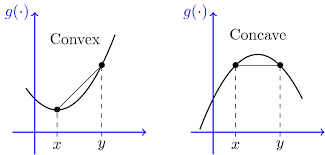

# Lecture 3

A function $f: \; \mathbb{R}^n \; \mapsto \; \mathbb{R}$ is convex if its $\text{dom} \;f$ is a convex set and it holds that

$$
f(\theta x + (1-\theta) y ) \leq \theta f(x) + (1-\theta) f(y) 
$$

for all $x, y \in \text{dom} \;f$, $0 \leq \theta \leq 1$. The following rule is a mixture of two points evaluated.

A graphical understanding is to draw a straight line between two points on a graph, ``the coord``, which then should lie above the graph, requiring the graph to have positive curvature, a concave function on the other hand, has negative curvature.

  

## Examples on R

Typical convex functions:

- Affine: $ax + b$
- Exponential: $e^{ax}$
- Power: $x^a$
- Absolute: $|x|^p$
- Negative Entropy: $x \log x$

How to figure out if those are convex? You simply draw it, does it have positve curvature?

Typical concave functions

- Affine: $ax + b$
- Power: $x^a$
- Log: $\log x$

## Examples on vector spaces

Affine functions are convex and concave; all norms are convex.

On Vectors:
- Affine functions $f(x) = a^T x + b$
- All norms, not trivial to show in general

On Matrices
- Affine function: $f(X) = tr(A^TX) + b = <A.X> + b$
- Spectral norm: $f(X) = \left| \left| X \right| \right|_2 = \sigma_{max}(X) = (\lambda_{max}(X^TX))^{0.5}$

## Restriction of a convex function to a line

a function $f$ is convex if and only if the function $g: R \; \mapsto \; R$,

$$\begin{matrix}
g(t) = f(x + tv), & & \text{dom }g = \{ t \; | \; x + tv \in \text{dom } f \}
\end{matrix}$$

is convex (int t) for any $x \in  \text{dom } f$, said in another way, you have to pass in any single line.

Example, $f: S^n \mapsto R$ with $f(X) = \text{log } \text{det }X$, $\text{dom } X = S^n_{++}$

now inserting any line, with $X, Y \in S^n_{++}$ we get

$$
g(t) = f(X +tV)
$$

to prove this, we need ``Sylvester's determinant theorem``, which states that the determinant of two matrices, (this is my way to prove it):

$$
\text{det } X + AB = \det{X} \cdot \det{I_n + BX^{-1}A}
$$

i.e.

$$
g(t) = \log \det{X} + \log \det{I + tVX^{-1}}
$$

since we are dealing with positive definite symmetric matrices, we may manipulate the equation and get the following

$$
g(t) = \log \det{X} + \log \det{I + tX^{-0.5}VX^{-0.5}}
$$

and knowing that the product of eigenvalues is equal to the determinant, we may find

$$
g(t) = \log \det{X} + \log \det{I + \sum \lambda_i} = \log \det{X} + \log \sum 1 + t\lambda_i
$$

> obviously that is not convex.. but concave 

## Extended-value extension

Extended-value extension $\hat{f}$ of $f$ is 

$$
\begin{matrix}
\hat{f}(x) = f(x), & x \in \text{dom } f, & \hat{f}(x) = \infty, & x \notin \text{dom } f
\end{matrix}
$$

only holds for convex functions, so, we basically assign the value infinity, if outside the domain, it is standard, for a concave function we do the opposite by minus infinity.

## First-order condition

A function $f$ is differentiable if $\text{dom } f$ is open and the gradient

$$
\nabla f(x) = \left( \frac{\partial f}{\partial x_1} , \frac{\partial f}{\partial x_2}, \frac{\partial f}{\partial x_3}, ...\right)
$$

exists for each $x \in \text{dom } f$.

1st-order condition, differentiable $f$ with convex domain is convex if

$$
f(y) \geq f(x) + \nabla f(x)^T (y-a), \; \; \; \text{for all } x, y \in \text{dom } f
$$

> The global taylor approximation is a global underestimator of the function, "from local information you get global conclusion".

## Second-order condition

A function $f$ is twice differentiable if $\text{dom } f$ is open and the Hessian $\nabla^2f(x) \in S^n$,

$$
\nabla^2f(x)_{ij} = \frac{\partial^2 f(x)}{\partial x_i \partial x_j}
$$

exists for each $x \in \text{dom } f$.

2st-order condition, differentiable $f$ with convex domain

- $f$ is convex if and only if

$$
\nabla^2f(x) \geq 0 \text{ for all } x \in \text{dom } f
$$

f is strictly convex if it is greater than 0.

> The global taylor approximation is a global underestimator of the function, "from local information you get global conclusion".

## Examples
- Quadratic function: $f(x) = \frac{1}{2} x^T P x + q^T x + r$ with $P \in S^n$

where $\nabla f(x) = Px + q,$ $\nabla^2 f(x) = P$.

- Least-squares objective is also convex $f(x) = \left | \left | Ax - b \right| \right|^2 _2$

where $\nabla f(x) = 2 A^T(Ax - b),$ $\nabla^2f(x) = 2A^TA$

- Quadratic-over-linear $f(x, y) = x^2 /y$

- log-sum-exp: $f(x) = \log \sum \exp x_k$

where $\nabla^2 f(x) = \frac{1}{1^Tz} \text{diag}(z) - \frac{zz^T}{(1^T z)^2}$, we need to show that it is positive-definite, which can be done by applying quadratic form - (Cauchy-Schwarz inequality).

- geometric mean: $f(x) = (\Pi^n_i x_k)^{1/n}$ is concave in $R^n_{++}$

## Epigraph and sublevel set

$\alpha$-sublevel set of $f: R^n \mapsto R$:

$$
C_\alpha = \{ x \in \text{dom } f \; | \; f(x) \leq \alpha  \}
$$

sublevel set of convex functions are convex (converse is false), they are atleast plausable values.

A epigraph of $f: R^n \mapsto R$:

$$
\text{epi } f = \{ (x, t) \in R^{n+1} \; | \; x \in \text{dom } f, f(x) \leq t \}
$$

(epi means above) if $f$ is convex, then $\text{epi } f$ is also a convex set, usually drawn as a shaded area above a graph in 2d.

## Jensen's inequality

basic inequality: if $f$ is convex then $0 \leq \theta \leq 1$:

$$
f(\theta x + (1-\theta)y) \leq \theta f(x) + (1-\theta) f(y)
$$

also called the triangle equality. An extension (there are dozens), is that you have a finite amount of points

$$
f(\bold{E}z ) \leq \bold{E}f(z)
$$

where $z$ is a random variable, is called `` Jensens inequality ``, a basic inequality is a special case with discrete distribution 

$$
\text{prob }(z = x) = \theta \; \; | \; \; \text{prob }(z = y) = 1-\theta
$$

> Manifacturing variation in general is not good, that is, you pay more when it goes bad, than when it goes good.

## Operations that preserve convexity

## Positive weighted sum and composition of affine functions

## Pointwise maximum

## Pointwise Supremum

## Composition with scalar functions

composistion of two functions $g: R^n \mapsto R$ and $h: R^n \mapsto R$

$$
f(x) = h(g(x))
$$

f is convex if $\begin{matrix} \text{g convex, h convex, } \dot{h} \text{ nondecreasing} \\
\text{g concave, h convex, } \dot{h} \text{ nonincreasing} \end{matrix}$

the proof (g, h is differentiable and n = 1)

$$
f''(x) = h''(g(x))g'(x)^2 + h'(g(x))g''(x)
$$

monotonicity must hold for extended-value extension $\dot{h}$

- $\exp{g(x)}$ is convex if g is convex, so exp preserves positive curvature
- $1/g(x)$ is convex if $g$ is concave and positive

## Vector Compositions

composistion of two functions $g: R^n \mapsto R^k$ and $h: R^k \mapsto R$

$$
f(x) = h(g(x))
$$

f is convex if $\begin{matrix} g_i\text{ convex, h convex, } \tilde{h} \text{ nondecreasing in each argument} \\
g_i\text{ concave, h convex, } \tilde{h} \text{ nonincreasing in each argument} \end{matrix}$

$$
f''(x) = g'(x)^T\nabla^2h(g(x))g'(x) + \nabla h(g(x))^Tg''(x)
$$

#### Lecture 3
> https://www.youtube.com/watch?v=kcOodzDGV4c

> http://ee.eng.usf.edu/people/snider2.html